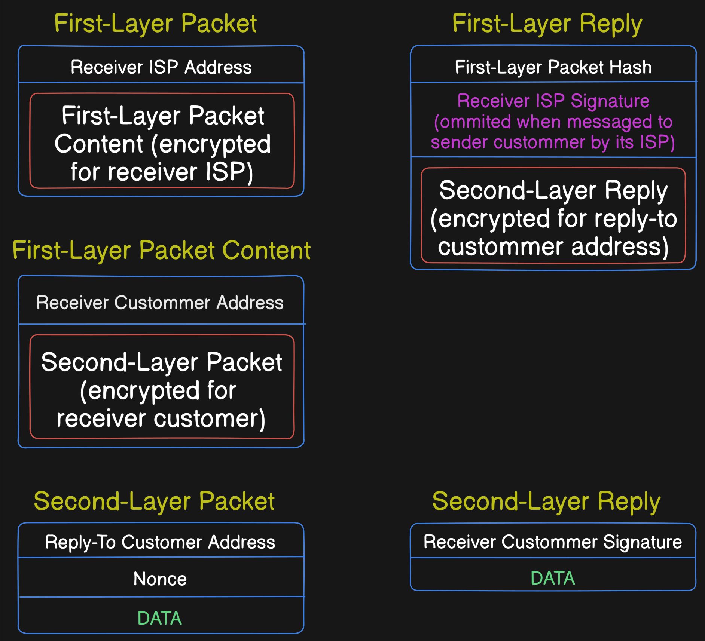

# bitrouting

A Decentralized Packet-Routing Alternative to IANA

## The Problem

Internet Centralization

Leave aside The Web, the actual network infrastructure it runs on, has been fundamentally captured by centralizing entities using unbalanced power to top-down impose made-up laws that lead to hierarchical relationships between otherwise free independent actors. In fact, the former is arguably ultimately caused by the latter: if anyone could easily spawn up a server anywhere, at any time, in a permissionless way, competition would push every service provider to really do their best, since a user, most probably having several competitors to choose from, would only use a given one as long as it finds it optimal. In other words, we would enjoy a system based on much better aligned incentives.

## The Main Barrier

Decentralizing Packet-Routing

Let's recap. A routed network protocol, like IP, is in principle decentralized: whenever a node wants to send a packet to a remote peer, this is just communicated to some connected neighbor over a shared Data Link channel, hoping that this process repeats forward and, after a number of hops, the packet finally arrives at its specified destination. The magic here is all of that can happen without neither the sender, nor the receiver, nor anyone in the middle for that matter, having to know anything about any other involved node, apart from the one(s) directly connected to them. So far so good, but that's definitely not how the current internet works, instead, it relies on routing protocols, whose rules are essentially dictated through centrally assigned ownership over address subspaces. But why so?

The above described scheme, where every node behaves perfectly, offering their best service connecting to their neighbors to forward their packets, could definitely work in a collectively owned relatively small size network. But as soon as we step out of this very narrow condition space, it starts to break down, basically because of two main reasons: lack of service incentives and difficulty of routing coordination. Hence, the aim of the hereby proposed protocol is to address these two issues, hopefully finding the most simple common solution for both.

## Free Market Routing

When who pays how much to whom for what?

Let's begin by identifying the different market actors involved in the operations of sending a packet from **S** to **R**, followed by the corresponding reply from **R** to **S**:

- **S** - the sender (client of **N1**): willing to pay some amount to a directly connected neighbor node **N1** that can make the packet get to **R**, proven by delivering back to **S** a signed reply from **R** acknowledging its reception (and likely providing some requested data)
- **N1** - first intermediary (server of **S**, client of **N2**): potentially interested (if able) in finding some next neighbor node **N2** that can in turn make the packet get to **R** (again, proven to **N1** by the acknowledging reply from **R**), for a lesser ammount, thereby securing the resulting difference from what **S** would pay
- ...
- **N-1** - last intermediary (server of **N-2**, client of **R**): directly connected neighbor of **R**, likely interested in accepting a very small amount from **N-2** for forwarding the packet to **R** (once more, the proof being **R**'s signed reply), since it would only incur the least amount for getting the reply directly from **R**
- **R** - the receiver (server of **N-1**): almost surely interested in responding (with a signed reply) to **N-1** for the least amount

What's key here is that **R**'s reply being a signed acknowledgement of reception of **S**'s packet, means no one needs to trust no one. At each step (hop), the client-server agreement is the simplest:
_I, the `client`, would pay you, the `server`, this `amount`, if you provide me with a signed reply from this `address`, acknowledging the reception of this `packet`._

That's it! This way, an honest node automatically knows:

- whether its server fulfilled the request, and if so, will pay the agreed amount
- whether it fulfilled its client's request, and if so, will expect to be paid the agreed amount

In practice, back-and-forth amounts would most likely be tallied up over agreed periods of times, in order to reduce the frequency of payments. A node operator would, of course, only engage in direct connections with somewhat trusted peers, and would disconnect from any such peer as soon as it starts misbehaving, which should lead to an interesting emergent functional reputation system. And last but not least, as an added benefit, let's highlight the fact that even **N-1**, being a directly connected neighbor of **R**, still needs to pay some likely very small but not null amount to it in order to receive a signed reply, which may be a good solution against DDoS attacks.

So let's imagine this very trust-minimized system can indeed solve the incentives problem. Now, what about the coordination needed for packet-routing? How could we manage to efficiently route packets globally without centralized allocation of address subspaces from which nodes build their routing tables?

## Network Discovery

Making first contact

Again here, let's think of this problem from the perspectives of two fundamentally different actors:

- new node wanting to be discoverable
- any node wanting to send a packet to some other possibly recently connected node

First of all, let's notice how every node, being a plausible intermediary in a potential delivery to basically any destination, will most likely be interested in building and keeping a big `address -> amount` key-value pairs routing table containing as many destinations as it can store, since that is ultimately the valuable info that it can then use to offer its services whenever any directly connected neighbor node asks for the `amount` charged for sending a packet to a given address. In fact, there's really no difference between a sender and any intermediary node, they all search for the very same thing: who can bring me the reply to this packet for the least amount. The deal just gets replicated downstream, with a decreasing amount being charged.

That being said, it might very well be that a node wants to send a packet to an address that none of its neighbors has registered, maybe because it's a recently connected one, so they cannot automatically answer with a known amount. In that case, each of them, if interested in serving as intermediary, would in turn try asking its other neighbors for the amount they would charge for sending a packet to that address. And this process would continue until some node can give an answer, which would then propagate back, with an increase in the charged amount, decided by each node before answering back to its potential client.

On the other hand, a newly connected node interested in being discoverable, would announce its service (amount) to its neighbors, each of which would again most likely be interested in both adding and keeping this useful info in its table, as well as in turn propagating it further to its other neighbors. This process is also likely to continue until either everyone knows how to reach the new address, or the amount becomes so high for far away nodes that it's not really useful anymore for them to keep an entry for this address, since it is unlikely that someone would pay that much for sending a packet to it.

In summary, at any point in time, each node would have two routing lists per neighbor (i.e. incoming and outgoing agreed routes), that together constitute the partial local knowledge of the network it possesses and uses to make every routing decision economically optimal. The full network graph (if such a thing even makes any sense in a dynamic network) is nowhere to be found, but more importantly, it's not needed!

## Second Layer

Asynchronous Communication

One important issue yet to address is the fact that, for a node to be part of such a network, it would need to be always available online, since going offline means it could fail to serve a neighbor's request to send a packet to an address included in their agreed routing table (i.e. breaking the contract).

Therefore, not everyone would want to take part in that kind of agreement, which leads naturally to the separation of actors in two distinct layers: ISPs and customers. This may at first sound not that different from the current state of affairs, but the key difference to highlight here is the absence of any central authority needed to go through in order to establish an ISP: it’s just a matter of finding some peer(s) to connect to, and customers interested in connecting through your infrastructure; which should lead to much healthier market competition.

The basic idea is that an ISP could, in a sense, rent to a customer a designated address, that anyone could then use as a packet’s destination in order to send to that customer. This sort of address delegation scheme effectively solves the asynchronous communication problem: whenever an ISP receives a packet intended for a given customer, it first tries to get from it a proper reply to sign and give back to the asking node (peer ISP), but if the customer is not available, it can still send some standard 404 reply, and communicate the event to the customer later when it comes back online. No one has to break any agreement.

One way to handle this last mile forwarding from ISP to customer could be by simply assigning customer-unique addresses. However, this comes with two main drawbacks for a customer:

- It preserves no unique identification when switching ISP
- It does not benefit from the likely very optimized routes (i.e. higher discoverability and lower amounts) its ISP has managed to generate through large numbers of operations. Instead, each new customer of even an already well known ISP would still go through the slower process of making itself globally known

With this in mind, an arguably better approach (see figure below) would be to encapsulate as encrypted content (only decryptable by the destination ISP) of a first-layer packet, the globally-unique customer address of the destination customer, together with a second-layer packet with the actual content being sent to it. Likewise, when the receiver customer gives back its second-layer reply, its ISP again encapsulates it inside the content of a first-layer reply to be propagated back to the sender ISP, which would finally hand it to the sender customer.

## Decentralized DNS

Tracking Customers' ISPs

Since each customer has a globally-unique customer address, independent of its ISP, this becomes its `name`: finding its full address(es) is just a matter of locating the ISP(s) it is connected to. A customer's ISP(s) could change over time, hence the demand emerges for a service able to provide this real-time info, i.e. a `Name Server`.

Since an NS would also charge some amount for replying to packets sent to it, it is incentivized to provide relyable data. On the other hand, a customer wanting to stay discoverable would also be incentivized to keep some NS(s) updated about its current ISP(s).

Here again, signed packets mean an NS does not need to trust a customer reporting this data. Moreover, it can also regularly check its validity by pinging the relevant customer through the registered ISP(s), again, verifying the signature of the reply.

## FAQs

### Would all these sign-verify operations allow for fast enough communications?

I do not know.

### What stops anyone from claiming the entire address space?

There's really no notion of ownership over an address. The way a node manages to receive packets sent to a given address is by keeping control of the corresponding private key that it uses to sign every reply that it communicates directly to any of its neighbors, as per agreement. Then for any other node, trying to steal an already taken address, would require it to either figure out the corresponding private key, or misbehave with their neighbors by tricking them into forwarding packets with that destination to this bad node and then defaulting on the agreement, being unable to provide a signed reply. On the one hand, this kind of misbehaviour would be unlikely to happen, since it automatically becomes apparent, causing reputational loss. But more importantly, it should be resolved immediately by nodes regularly cutting these broken connections off. In summary, a node would be interested in receiving packets to a given address only if it has either the control (private key) of it, or routing agreement with some other neighbor whom it would then forward to and expect a reply from.

### Is this packet-reply scheme considered a network or transport layer protocol?

I guess it's somewhat of an in-between thing. Since a reply to every packet is enforced, ordered messaging is already achieved. Therefore a proper transport layer built on top of it, would only need to take care of guaranteeing losslessness and handling ports.

### How to get from here to there?

That's a tough one. Technology-wise, I think a clearly defined protocol and compliant devices/firmwares is all that's needed. When it comes to the social layer though, there I don't dare to speak.

## Sources of Inspiration

- _The Bitcoin Standard: The Decentralized Alternative to Central Banking_, by Saifedean Ammous (and Bitcoin in general)
- The Lightning Network
- The NOSTR protocol: _Notes and Other Stuff Transmitted by Relay_
- Many more things I cannot remember now, but probably had some influence
